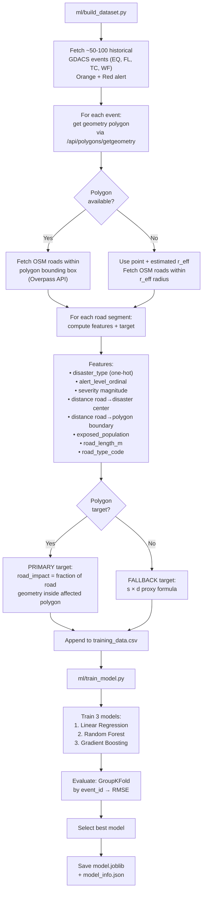
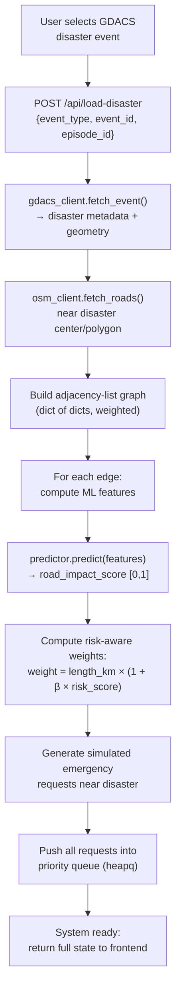
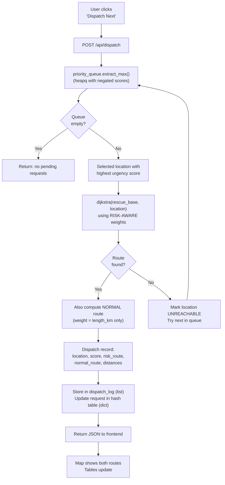

# ML + DSA Disaster Response Routing System
## Architecture & Implementation Plan

---

## 1. Project Understanding

This project builds a **small, working web application** that combines:

- **Live disaster data** from GDACS (earthquakes, floods, cyclones, wildfires)
- **Real road network** from OpenStreetMap
- **A trained ML model** that predicts how badly each road is affected by a disaster
- **DSA algorithms** (priority queue, Dijkstra, graph, hash table) that use those ML predictions to schedule and route emergency responses

**What it does, end to end:**

1. User selects a live GDACS disaster event (or one is loaded by default)
2. The system fetches the nearby OSM road network
3. An ML model predicts a `road_impact_score ∈ [0, 1]` for every road segment
4. Those scores adjust Dijkstra edge weights: high-risk roads become expensive
5. Emergency requests are prioritized by a heap-based priority queue
6. Dijkstra finds the best risk-aware route to the top-priority emergency
7. The web interface shows the disaster, roads color-coded by risk, the selected route, and normal-vs-risk-aware comparison

**What it is NOT:**
- An evacuation system
- A route predictor that replaces Dijkstra with ML
- A production disaster-management platform
- A flood-only system (it handles multiple disaster types)

---

## 2. System Architecture

```
┌─────────────────────────────────────────────────────────────────┐
│                         WEB BROWSER                             │
│                                                                 │
│  ┌────────────────────────────────────────────────────────────┐  │
│  │                    LEAFLET MAP (primary)                   │  │
│  │  • Disaster area polygon/marker                           │  │
│  │  • Roads color-coded by predicted impact (green→red)      │  │
│  │  • Emergency location markers                             │  │
│  │  • Dijkstra route (risk-aware) highlighted                │  │
│  │  • Normal route comparison (dashed)                       │  │
│  └────────────────────────────────────────────────────────────┘  │
│  ┌─────────────┐ ┌─────────────────┐ ┌───────────────────────┐  │
│  │ Disaster    │ │ Emergency       │ │ Dispatch Result /     │  │
│  │ Selector    │ │ Queue (ranked)  │ │ Route Comparison      │  │
│  │ + Info      │ │ + Dispatch Btn  │ │ + Model Info          │  │
│  └──────┬──────┘ └────────┬────────┘ └───────────┬───────────┘  │
│         └─────────────┬───┴──────────────────────┘              │
│                  fetch(/api/...)                                 │
└───────────────────────┬─────────────────────────────────────────┘
                        │ HTTP / JSON
┌───────────────────────┴─────────────────────────────────────────┐
│                      FLASK BACKEND                              │
│                                                                 │
│  ┌──────────────────────────────────────────────────────────┐   │
│  │  api/routes.py — REST endpoints                          │   │
│  │    GET  /api/disasters          → list current GDACS     │   │
│  │    POST /api/load-disaster      → load event + roads     │   │
│  │    GET  /api/state              → full system state      │   │
│  │    POST /api/dispatch           → dispatch next          │   │
│  │    POST /api/road/block         → manually block road    │   │
│  │    POST /api/road/unblock       → unblock road           │   │
│  │    POST /api/reset              → reset scenario         │   │
│  │    GET  /api/model-info         → ML model metrics       │   │
│  └──────────────────┬───────────────────────────────────────┘   │
│                     │                                           │
│  ┌──────────────────┴───────────────────────────────────────┐   │
│  │  services/dispatcher.py — ORCHESTRATOR                   │   │
│  │    Loads disaster → builds graph → runs ML → dispatches  │   │
│  └─────┬──────────┬──────────┬──────────┬───────────────────┘   │
│        │          │          │          │                        │
│  ┌─────┴────┐ ┌──┴────┐ ┌──┴────┐ ┌──┴──────────────────┐     │
│  │ Priority │ │ Graph │ │Dijkstra│ │ ML Predictor        │     │
│  │ Queue    │ │ (adj  │ │       │ │                      │     │
│  │ (heapq)  │ │ list) │ │       │ │ Loads model.joblib   │     │
│  │          │ │ +block│ │       │ │ Predicts road_impact │     │
│  │          │ │ /unblk│ │       │ │ Adjusts edge weights │     │
│  └──────────┘ └───────┘ └───────┘ └──────────────────────┘     │
│                                                                 │
│  ┌──────────────────────────────────────────────────────────┐   │
│  │  services/gdacs_client.py — GDACS API client             │   │
│  │    Fetches current events, event details, geometry        │   │
│  └──────────────────────────────────────────────────────────┘   │
│  ┌──────────────────────────────────────────────────────────┐   │
│  │  services/osm_client.py — OSM road network fetcher       │   │
│  │    Downloads roads near disaster, builds adjacency list   │   │
│  └──────────────────────────────────────────────────────────┘   │
│                                                                 │
│  OFFLINE (run once):                                            │
│  ┌──────────────────────────────────────────────────────────┐   │
│  │  ml/build_dataset.py     → historical GDACS + OSM roads  │   │
│  │  ml/train_model.py       → trains 3 models, selects best │   │
│  │  ml/model.joblib          → saved trained model           │   │
│  └──────────────────────────────────────────────────────────┘   │
└─────────────────────────────────────────────────────────────────┘
```

---

## 3. Historical ML Training Flow



### Key Design Decisions — Training

**Data source:** GDACS API returns GeoJSON `FeatureCollection` responses. The events endpoint provides event metadata; the geometry endpoint provides affected-area polygons. I have confirmed both are accessible without authentication.

**Road data for training:** Use the Overpass API directly (not OSMnx) to avoid heavy GDAL/geopandas dependencies. A simple `requests`-based query fetches road ways within a bounding box. The `shapely` library handles geometry intersection calculations.

**Polygon availability (confirmed from live API testing):**
- **Floods (FL):** Rich polygons available (confirmed: Mozambique flood returned a detailed polygon with hundreds of coordinates)
- **Earthquakes (EQ):** Often have ShakeMap-derived polygons or intensity contours
- **Cyclones (TC):** Often have wind field polygons
- **Wildfires (WF):** Sometimes have fire perimeter polygons
- **Droughts (DR):** Usually only centroids → fallback proxy

**Sample size target:** ~50–100 historical events × ~50–200 road samples per event = ~5,000–15,000 training rows. This is more than sufficient for the three lightweight models.

---

## 4. Live Inference Flow



---

## 5. Emergency / DSA Flow



### Where Each DSA Structure Lives

| DSA Structure | Python Type | Module | Purpose |
|---|---|---|---|
| **Hash Table** | `dict` | `dispatcher.py` | `self.requests = {}` — O(1) lookup/update by location_id |
| **Hash Table** | `dict` of `dict`s | `graph.py` | `self.adj = {}` — adjacency list representation |
| **Array/List** | `list` | `dispatcher.py` | `self.arrival_log = []` — chronological request log |
| **Array/List** | `list` | `dispatcher.py` | `self.dispatch_log = []` — dispatch history |
| **Priority Queue** | `heapq` | `priority_queue.py` | Max-heap (negated scores) for urgency ordering |
| **Dijkstra** | `heapq` internal | `dijkstra.py` | Min-heap driven shortest path with risk-aware weights |

---

## 6. Exact Formulas

### 6.1 ML Training Target — PRIMARY (specification-defined)

When GDACS provides an affected-area polygon:

```
road_impact_score = length_of_road_inside_polygon / total_road_length
```

- Result ∈ [0, 1]
- Road completely outside → 0.0
- Road 30% inside → 0.3
- Road completely inside → 1.0

> [!IMPORTANT]
> This is **weak supervision**, not ground-truth physical road damage. The labels represent spatial exposure/overlap with the GDACS-reported affected area.

### 6.2 ML Training Target — FALLBACK (project implementation choice)

When no usable polygon exists (point-only events):

**Severity term:**

```
s = (alert_level_ordinal - 1) / 2

where:
  Green  → ordinal 1 → s = 0.0
  Orange → ordinal 2 → s = 0.5
  Red    → ordinal 3 → s = 1.0
```

**Effective radius (data-derived proxy):**

Instead of hardcoded arbitrary radii, `r_eff` is derived dynamically from historical spatial distribution data of similar event types and severities, consistent with Architecture 1. If polygon area `area_km2` is available:
```
r_eff = sqrt(area_km2 / π)
```
Otherwise, use the dynamically derived median radius for that specific `(disaster_type, severity_level)` combination.

**Spatial decay:**

```
if road intersects affected polygon:
    d = 1
else:
    d = exp(-dist_km / r_eff)
```

**Final fallback target:**

```
road_impact_score = clip(s × d, 0, 1)
```

> [!NOTE]
> This is a **proxy-label fallback**, not observed road damage. It is used only when GDACS does not provide a suitable polygon geometry.

### 6.3 Routing Edge Weight (project implementation choice)

**Risk-aware routing:**

```
weight = length_km × (1 + β × risk_score)
```

- `β = 9` (initial value — means a risk_score=1.0 road costs 10× its normal length)
- Weight is always positive (minimum = `length_km` when `risk_score = 0`)

**Normal routing (comparison):**

```
weight = length_km
```

Both routes are computed and displayed side-by-side to demonstrate the ML's effect.

### 6.4 Emergency Urgency Score (specification-defined + implementation choice)

```
score = 5 × severity
      + 4 × medical_urgency
      + 2 × log(affected_people + 1)
      + waiting_bonus
```

Where:
- `severity` ∈ [1, 5] — from specification
- `medical_urgency` ∈ [1, 5] — from specification
- `affected_people` ∈ positive integer — from specification
- `log` = natural logarithm — from specification
- `waiting_bonus = min(waiting_minutes × 0.5, 10.0)` — **implementation choice** (capped to prevent old low-priority requests from dominating)

---

## 7. Model Selection

### Why These Three Models

| Model | Why Include |
|---|---|
| **Linear Regression** | Baseline. Fastest, most interpretable. Shows whether the relationship is approximately linear. Easy to explain in viva. |
| **Random Forest** | Handles non-linear interactions (e.g., road type × distance). Robust to outliers. Good default for tabular data. |
| **Gradient Boosting** | Often best accuracy on tabular data. Sequential correction of errors. Slightly more complex but still lightweight. |

All three are from scikit-learn, require no GPU, train in seconds on ~10K rows, and produce a small serialized model file.

### Evaluation Metric

**RMSE (Root Mean Squared Error)** on the predicted `road_impact_score` vs. the target.

RMSE is chosen because:
- The target is continuous ∈ [0, 1]
- We care about large errors more than small ones (a road predicted as 0.1 when it should be 0.9 is dangerous)
- It's simple to explain

### Split Strategy

**GroupKFold with `event_id` as the group**, using K=5.

This ensures that:
- All road samples from the same disaster event are in the same fold
- The model is evaluated on its ability to generalize to **unseen disaster events**
- No leakage between training and validation from the same event

### Winner Selection

The model with the **lowest mean RMSE across the 5 folds** is selected. Results for all three models are logged and saved to `model_info.json` for display in the UI.

---

## 8. Technology Stack

| Layer | Technology | Justification |
|---|---|---|
| **Backend** | Python 3.10+ / Flask | Lightweight, you know Python, spec requires Python |
| **ML** | scikit-learn + joblib | Sufficient for all three models, no GPU needed |
| **Geometry** | shapely | Lightweight. Needed for polygon intersection (road inside affected area) |
| **Data** | JSON / CSV / GeoJSON | No database — everything in memory + files |
| **Road data** | Overpass API (via `requests`) | Avoids OSMnx's heavy dependency chain (GDAL, Fiona, geopandas). Simple HTTP queries |
| **Disaster data** | GDACS REST API (via `requests`) | Free, no auth, GeoJSON responses |
| **Map** | Leaflet.js (CDN) | Free, lightweight, works with OSM tiles |
| **Frontend** | Vanilla HTML + CSS + JS | No framework overhead. Full control over aesthetics. Fastest to build |
| **HTTP client** | `requests` | Standard Python library for API calls |

### Explicitly NOT Using

- OSMnx (heavy deps, Windows installation risk)
- React/Vue/Next.js (unnecessary for a single-page app)
- Databases (no persistence needed)
- WebSockets (polling or manual refresh is fine)
- TomTom/HERE/Waze (commercial, unnecessary)
- Deep learning / neural networks
- Docker / cloud / microservices

---

## 9. External Services / Data Sources

| Service | Purpose | Auth Required | API Key | Free | Rate Limits | License |
|---|---|---|---|---|---|---|
| **GDACS API** | Historical + live disaster events, geometry polygons | **No** | **No** | **Yes** | Informal (be polite, add delays) | CC BY 4.0 — free for educational use with attribution |
| **Overpass API** | OSM road network extraction | **No** | **No** | **Yes** | ~10k requests/day, max 2 concurrent | ODbL — free with attribution ("© OpenStreetMap contributors") |
| **OSM Tile Server** | Leaflet map background tiles | **No** | **No** | **Yes** | Usage policy: ~reasonable usage | Same ODbL |

> [!TIP]
> **All three services are free, require no authentication, and no API keys.** This is ideal for a public GitHub project — no secrets to manage for data access.

### Licensing Compliance

- **GDACS data (CC BY 4.0):** We must include attribution. Educational + ML training use is explicitly permitted. Derived outputs (predictions) can be used freely.
- **OSM data (ODbL):** We must include "© OpenStreetMap contributors" on the map and in the README. Educational use is permitted. We should not redistribute large raw OSM extracts — our training data contains derived features, not raw OSM dumps.
- **Generated training data:** The CSV contains computed features (distances, fractions, scores) derived from GDACS + OSM. This is transformative use. The CSV can be committed to GitHub if it remains reasonable in size (<50 MB). We will include a data attribution note.

---

## 10. What I Need You to Provide

**Nothing.** 🎉

All external services (GDACS, Overpass API, OSM tiles) are:
- Free
- No authentication required
- No API keys required
- No account creation required

The only software prerequisites on your machine are:
- **Python 3.10+** (already installed — confirmed from pip output)
- **pip** (already working)
- A **web browser** (for viewing the app)

---

## 11. Security / Privacy / Licensing Plan

### Secrets Management

| Item | Approach |
|---|---|
| Flask secret key | Generated randomly at startup (`os.urandom(24)`), never committed |
| `.env` file | Not needed (no API keys), but `.env.example` created for documentation |
| `.gitignore` | Will include: `.env`, `__pycache__/`, `*.pyc`, `model.joblib` (optional — see below), `venv/`, `.vscode/` |

Since **no API keys are required**, the primary secret concern is the Flask session secret, which is auto-generated and never written to disk.

### Repository Safety Checklist (before GitHub publish)

- [ ] No hardcoded secrets, tokens, or passwords
- [ ] No `.env` file committed
- [ ] No raw GDACS API responses cached with sensitive headers
- [ ] No personal information in code or data
- [ ] `.gitignore` covers all generated/sensitive files
- [ ] Attribution for GDACS (CC BY 4.0) in README
- [ ] Attribution for OSM (ODbL) in README and on map
- [ ] Training data CSV contains only derived features, not raw OSM geometry dumps
- [ ] `model.joblib` can be committed (it's a small scikit-learn model, ~100 KB, containing only learned parameters — no PII)

### Privacy

- No user accounts, no authentication
- No analytics, tracking, cookies, or telemetry
- No personal data collected
- Error messages never expose internal paths, API responses, or stack traces to the browser

### Error Handling Security

- Backend errors return generic JSON: `{"error": "description"}` with appropriate HTTP status
- Raw exception details logged server-side only (to console), never sent to frontend
- GDACS/Overpass failures return user-friendly messages + offer demo/fallback data

---

## 12. Phased Implementation Plan

### Phase 1 — Foundation + Data Pipeline Scripts
**Goal:** Project structure, GDACS client, Overpass client, and the ML dataset-building script.

**Delivers:**
- Project directory structure with all placeholder files
- `requirements.txt`
- `services/gdacs_client.py` — fetch events list, fetch event detail, fetch geometry
- `services/osm_client.py` — fetch road network from Overpass API for a bounding box
- `ml/build_dataset.py` — iterate historical events, pair with roads, compute features + target, output `training_data.csv`
- Error handling for missing fields, missing polygons, Overpass rate limits

**Files:**
```
disaster-response/
├── app.py                  (skeleton)
├── requirements.txt
├── services/
│   ├── __init__.py
│   ├── gdacs_client.py
│   └── osm_client.py
├── ml/
│   ├── __init__.py
│   └── build_dataset.py
└── .gitignore
```

**Dependencies:** None (first phase).

**Tests:**
- Run `build_dataset.py` — produces `training_data.csv` with >1000 rows
- Inspect CSV: features are populated, targets ∈ [0, 1], no NaN in critical columns
- Verify multiple disaster types present (EQ, FL, TC, WF)

**Definition of done:** `training_data.csv` exists with reasonable data from multiple event types.

**Not yet:** Model training, graph, Dijkstra, priority queue, web interface, emergency requests.

---

### Phase 2 — ML Model Training + Selection
**Goal:** Train three models, evaluate with GroupKFold, select and save the best.

**Delivers:**
- `ml/train_model.py` — loads CSV, trains Linear Regression / Random Forest / Gradient Boosting, evaluates with GroupKFold, saves best model
- `ml/model.joblib` — serialized best model
- `ml/model_info.json` — metrics for all three models (RMSE, name of winner)
- `ml/predictor.py` — loads model, provides `predict(features_df) → risk_scores` interface

**Files:**
```
ml/
├── train_model.py
├── predictor.py
├── model.joblib          (generated)
├── model_info.json       (generated)
└── training_data.csv     (from Phase 1)
```

**Dependencies:** Phase 1 (training data).

**Tests:**
- Model trains without errors
- All three models produce valid RMSE scores
- Best model saved successfully
- `predictor.predict()` returns scores ∈ [0, 1] for sample inputs
- GroupKFold splits confirmed (no event leakage)

**Definition of done:** `model.joblib` exists, `model_info.json` shows comparison of 3 models, predictor works.

**Not yet:** Graph, Dijkstra, priority queue, web interface, live GDACS integration.

---

### Phase 3 — DSA Core: Graph + Priority Queue + Dijkstra
**Goal:** Implement all DSA components with clear, viva-explainable code.

**Delivers:**
- `models/request.py` — `EmergencyRequest` class with `urgency_score()` method
- `data_structures/priority_queue.py` — max-heap wrapper using `heapq` with negated scores
- `data_structures/graph.py` — adjacency-list graph with `add_edge`, `block_road`, `unblock_road`
- `algorithms/dijkstra.py` — Dijkstra with path reconstruction, returns `(distance, path)` or unreachable
- Unit tests for each component

**Files:**
```
models/
└── request.py
data_structures/
├── __init__.py
├── priority_queue.py
└── graph.py
algorithms/
├── __init__.py
└── dijkstra.py
tests/
└── test_dsa.py
```

**Dependencies:** None (independent of Phases 1-2, but will integrate in Phase 4).

**Tests:**
- Priority queue: insert 7 requests, extract in correct urgency order
- Graph: add edges, block road, verify neighbors exclude blocked, unblock restores
- Dijkstra: find shortest path, verify against hand-calculated result
- Dijkstra: blocked road forces alternate route
- Dijkstra: all paths blocked → returns unreachable
- All tests pass via `python -m pytest tests/test_dsa.py`

**Definition of done:** All DSA tests pass. Code is clean enough to trace each algorithm step.

**Not yet:** ML integration, dispatcher, API, frontend.

---

### Phase 4 — Dispatcher + ML Integration + Live GDACS
**Goal:** Wire everything together: load a live disaster, build risk-aware graph, dispatch emergencies.

**Delivers:**
- `services/dispatcher.py` — orchestrator: loads disaster → fetches roads → builds graph → runs ML → manages emergency queue → dispatches
- `services/emergency_generator.py` — generates plausible emergency requests near the disaster location
- Integration of ML predictions into graph edge weights
- Normal vs. risk-aware route comparison
- Fallback/demo mode if GDACS or Overpass is unavailable

**Files:**
```
services/
├── dispatcher.py
├── emergency_generator.py
├── gdacs_client.py       (from Phase 1)
└── osm_client.py         (from Phase 1)
```

**Dependencies:** Phases 1, 2, 3.

**Tests:**
- Load a known GDACS event → graph built with correct number of nodes/edges
- ML predictions applied → edge weights differ from raw lengths
- `dispatch_next()` returns highest-priority emergency with a valid route
- Blocking a road changes the route
- Unreachable detection works
- Fallback mode works when GDACS is unreachable

**Definition of done:** Full pipeline works from live GDACS event to dispatch result, testable via Python script.

**Not yet:** REST API, web interface.

---

### Phase 5 — Flask REST API
**Goal:** Expose all backend operations via HTTP endpoints.

**Delivers:**
- `api/routes.py` — all REST endpoints (see architecture diagram)
- `app.py` — Flask app with blueprint registration
- JSON serialization for all responses (graph state, requests, routes, model info)
- Error handling: GDACS down, Overpass down, no routes, empty queue
- CORS headers if needed

**Endpoints:**

| Method | Endpoint | Action |
|---|---|---|
| GET | `/api/disasters` | List recent GDACS events |
| POST | `/api/load-disaster` | Load specific event, build graph, generate emergencies |
| GET | `/api/state` | Full system state (graph, requests, queue, dispatch log) |
| POST | `/api/dispatch` | Dispatch highest-priority emergency |
| POST | `/api/road/block` | Manually block a road |
| POST | `/api/road/unblock` | Unblock a road |
| POST | `/api/reset` | Reset to initial state |
| GET | `/api/model-info` | ML model comparison metrics |

**Dependencies:** Phase 4 (dispatcher is the backend).

**Tests:**
- `curl` or test script exercises all endpoints
- Load disaster → dispatch → verify JSON response
- Error responses for invalid requests

**Definition of done:** All endpoints working, JSON responses correct, error handling in place.

**Not yet:** Frontend.

---

### Phase 6 — Web Interface + Map Visualization
**Goal:** Build the complete control-room UI with Leaflet map as the primary visual element.

**Delivers:**
- `templates/index.html` — single-page application
- `static/css/style.css` — dark control-room aesthetic, restrained typography
- `static/js/app.js` — API calls, state management
- `static/js/map.js` — Leaflet map: disaster area, roads color-coded by risk, route animation, markers
- `static/js/ui.js` — panels, tables, controls

**UI Elements:**
- **Map (primary):** disaster polygon/marker, roads colored by predicted impact (green→yellow→red), emergency markers, route highlight (solid = risk-aware, dashed = normal), click-to-block roads
- **Disaster panel:** selector, event info (type, alert level, country, severity)
- **Emergency panel:** ranked queue table, dispatch button
- **Result panel:** dispatch record, route comparison (risk-aware distance vs. normal distance), model info
- **Controls:** reset, load new disaster

**Dependencies:** Phase 5 (API must be working).

**Tests:**
- Manual walkthrough: load disaster → see map → dispatch → see route → block road → dispatch again
- Verify map renders correctly with roads and disaster area
- Verify route comparison visible
- Verify unreachable location handling

**Definition of done:** Complete working web app with interactive map.

**Not yet:** Final polish, README, GitHub prep.

---

### Phase 7 — Testing, Polish, GitHub Readiness
**Goal:** Final testing, UI polish, documentation, security review.

**Delivers:**
- End-to-end test with multiple disaster types
- UI polish: loading states, error messages, edge cases
- `README.md` — project description, setup instructions, screenshots, attribution
- `LICENSE` — MIT
- `.gitignore` — comprehensive
- `.env.example` — (minimal, mainly for documentation)
- Security review: no secrets, no PII, attribution complete
- Data attribution notes in README

**Dependencies:** All previous phases.

**Tests:**
- Load earthquake → works
- Load flood → works
- Load cyclone → works
- GDACS unavailable → fallback/error message
- All DSA operations verifiable (trace priority queue, trace Dijkstra)

**Definition of done:** Ready for `git push` to public GitHub. Application works end-to-end. Viva-ready.

---

## 13. 3–4 Hour Feasibility Assessment

### Time Budget Estimate

| Phase | Estimated Time | Risk Level |
|---|---|---|
| Phase 1: Data pipeline | 40 min | 🟡 Medium — Overpass rate limits, GDACS response parsing |
| Phase 2: ML training | 25 min | 🟢 Low — straightforward scikit-learn |
| Phase 3: DSA core | 30 min | 🟢 Low — well-defined algorithms |
| Phase 4: Integration | 35 min | 🟡 Medium — wiring everything together |
| Phase 5: REST API | 20 min | 🟢 Low — thin wrapper |
| Phase 6: Frontend | 50 min | 🟡 Medium — map + UI design |
| Phase 7: Polish | 20 min | 🟢 Low — cleanup |
| **Total** | **~3.5 hours** | |

### Highest-Risk Items + Fallbacks

| Risk | Impact | Likelihood | Fallback |
|---|---|---|---|
| **Overpass API rate-limited during dataset building** | Blocks Phase 1 | Medium | Add delays between requests. Reduce to ~30 events. Cache raw responses to disk so re-runs skip already-fetched events. |
| **GDACS polygon geometry missing for many events** | Reduces training quality | Medium | Use the fallback proxy formula (s × d) for point-only events. Prioritize flood/earthquake events which reliably have polygons. |
| **Shapely geometry intersection slow on large polygons** | Slows Phase 1 | Low | Simplify polygons before intersection. Limit road samples per event to ~200. |
| **OSM road network too large for some disasters** | Memory/performance | Medium | Limit Overpass query to a small bounding box (e.g., 10km radius). For very large disaster areas, sample a sub-region. |
| **Frontend map rendering slow with many roads** | Poor UX | Low | Limit displayed roads to ~500 segments. Simplify geometries for rendering. |
| **GDACS unavailable during demo** | Demo fails | Low | Include a bundled fallback scenario (pre-fetched event + roads + predictions) that loads without network. Clearly label as "demo data". |

### Critical Path

The most time-sensitive dependency chain is:

```
Phase 1 (data pipeline) → Phase 2 (ML training) → Phase 4 (integration)
```

If Phase 1 takes longer than expected (Overpass rate limits), the rest compresses. Phase 3 (DSA core) is independent and can be built in parallel.

---

## 14. Scope Lock

### MUST HAVE (Core — without these it's not the project)

- ✅ GDACS historical data → ML training dataset (automated)
- ✅ Three ML models trained + compared (Linear Reg, RF, GBR)
- ✅ Best model saved and used for inference
- ✅ Live GDACS disaster loading
- ✅ OSM road network fetching
- ✅ ML road-impact prediction → risk-aware edge weights
- ✅ Priority queue (heapq) for emergency scheduling
- ✅ Dijkstra shortest path on risk-aware graph
- ✅ Hash table (dict) for request storage + graph adjacency
- ✅ Array (list) for arrival log + dispatch history
- ✅ Urgency score formula from specification
- ✅ Unreachable-location detection
- ✅ Normal vs. risk-aware route comparison
- ✅ Web interface with Leaflet map
- ✅ Roads color-coded by predicted impact
- ✅ Dispatch route displayed on map

### SHOULD HAVE (High value, included in timeline)

- ✅ Disaster area polygon displayed on map
- ✅ Click-to-block/unblock roads
- ✅ Emergency markers on map
- ✅ Model comparison info in UI
- ✅ Fallback/demo mode when GDACS unavailable
- ✅ Multiple disaster type support (EQ, FL, TC, WF)
- ✅ README with attribution

### OPTIONAL (Only if time remains)

- ⬜ Algorithm trace panel (step-by-step Dijkstra visualization)
- ⬜ Adjustable β slider in UI
- ⬜ Feature importance chart from the ML model
- ⬜ Export dispatch report

### OUT OF SCOPE (Explicitly excluded)

- ❌ Deep learning / neural networks / CNNs
- ❌ Satellite imagery processing
- ❌ Real-time traffic data (TomTom, HERE, Waze)
- ❌ Multiple rescue teams / concurrent dispatch
- ❌ User authentication / accounts
- ❌ Database persistence
- ❌ WebSockets / real-time push
- ❌ Mobile-responsive UI
- ❌ Cloud deployment
- ❌ Manual data labeling
- ❌ Physical disaster simulation

---

## Project File Structure (Final)

```
disaster-response/
├── app.py                          # Flask entry point
├── requirements.txt                # pip dependencies
├── .gitignore
├── .env.example                    # Documentation only
├── README.md
├── LICENSE                         # MIT
│
├── models/
│   ├── __init__.py
│   └── request.py                  # EmergencyRequest + urgency_score()
│
├── data_structures/
│   ├── __init__.py
│   ├── priority_queue.py           # Binary heap (heapq wrapper)
│   └── graph.py                    # Adjacency-list graph + block/unblock
│
├── algorithms/
│   ├── __init__.py
│   └── dijkstra.py                 # Dijkstra's shortest path
│
├── services/
│   ├── __init__.py
│   ├── gdacs_client.py             # GDACS API client
│   ├── osm_client.py               # Overpass API client
│   ├── dispatcher.py               # Orchestrator
│   └── emergency_generator.py      # Generate simulated emergencies
│
├── api/
│   ├── __init__.py
│   └── routes.py                   # Flask REST endpoints
│
├── ml/
│   ├── __init__.py
│   ├── build_dataset.py            # Historical GDACS → training CSV
│   ├── train_model.py              # Train + compare 3 models
│   ├── predictor.py                # Load model, predict risk scores
│   ├── training_data.csv           # Generated training data
│   ├── model.joblib                # Saved best model
│   └── model_info.json             # Model comparison metrics
│
├── static/
│   ├── css/
│   │   └── style.css
│   └── js/
│       ├── app.js                  # Main application logic
│       ├── map.js                  # Leaflet map management
│       └── ui.js                   # UI panels and controls
│
├── templates/
│   └── index.html                  # Single-page application
│
└── tests/
    └── test_dsa.py                 # DSA component unit tests
```
